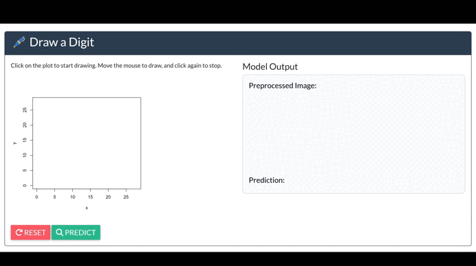

# 🖊️ Shiny Digit Recognizer

This is a simple and interactive **Shiny App** for handwritten digit recognition.

It uses a **Convolutional Neural Network (CNN)** trained on the **MNIST** dataset via `keras`, allowing users to draw a digit directly in the UI and get a real-time prediction.

This project was developed a few years ago and recently rediscovered on my PC. So, I've refreshed it a little bit and published it to share with others who want to learn some basics from it. 😊

## 📸 Preview

 <!-- Add a PNG screenshot of your app here -->

---

## 🚀 Features

- Freehand digit drawing (0-9) on a 28x28 canvas
- Automatic image preprocessing:
  - Cropping
  - Resizing
  - Blurring and centering on a 28x28 canvas
- Real-time prediction using a pre-trained CNN model (code available)
- Display of both preprocessed image and predicted digit

---

## 🧠 Model

The CNN model is trained on the **MNIST** dataset and saved in `.hdf5` format (`CNNmnist.hdf5`). Make sure the model file is placed in the root directory of the app.
The code for training the model is available in `computer vision in R with Keras.R`

---

## 📦 Dependencies

Install the required R packages:

```r
install.packages("shiny")
install.packages("shinyWidgets")
install.packages("imager")
install.packages("keras") # keras requires TensorFlow backend so follow instructions
```

## ⚙️ How to run the app

Just clone the repository and run the app:

```r
library(shiny)
runApp()
```
